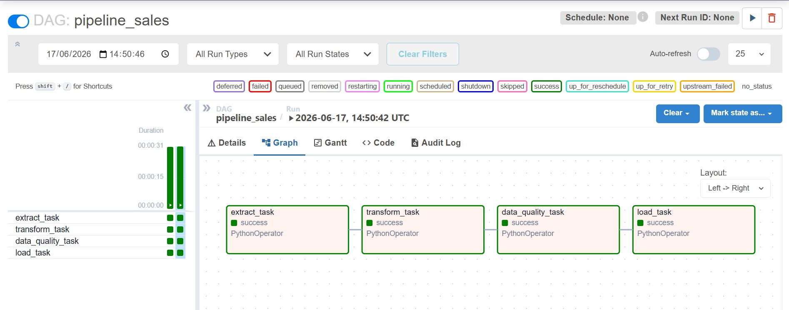

# Automated Sales ETL Pipeline avec Apache Airflow & Astro CLI

[](https://airflow.apache.org/)
[](https://www.python.org/)
[](https://www.docker.com/)
[](https://www.postgresql.org/)

## 📝 Présentation du Projet
Ce projet implémente un pipeline **ETL (Extract, Transform, Load)** de démonstration automatisé pour orchestrer et traiter les données de ventes d'une entreprise. Développé avec **Apache Airflow** (via l'écosystème **Astro CLI**), ce pipeline réalise l'extraction, le nettoyage et la validation de la qualité des données (**Data Quality**) et le chargement final dans un entrepôt de données **PostgreSQL**.

L'objectif principal est de transformer des données brutes hétérogènes et potentiellement compromises (anomalies d'âge, montants négatifs, valeurs manquantes) en une source de vérité unique, propre et directement exploitable pour des outils de Business Intelligence (BI) ou des équipes Analytics.

---

## 📸 Aperçu du pipeline (Airflow Dashboard)
Voici le rendu visuel du pipeline ETL lorsqu'il s'exécute avec succès. Toutes les étapes (de l'extraction au chargement final dans le Data Warehouse) sont validées et au vert :

 

---

## 🏗️ Architecture Globale & Flux de Données
Le workflow est orchestré de manière séquentielle et résiliente, s'appuyant sur l'échange d'états en mémoire (**XComs**) d'Airflow et une base de données cible PostgreSQL isolée.

[ Données Brutes (CSV) ]
│
▼

EXTRACTION  ──► Importation du fichier source via chemins dynamiques
│
▼ (XCom)

TRANSFORMATION ──► Nettoyage, typage, imputation & feature engineering
│
▼ (XCom)

DATA QUALITY  ──► Pare-feu de conformité strict (Zéro tolérance aux anomalies)
│
▼ (XCom)

CHARGEMENT   ──► Insertion optimisée par paquets (Bulk Insert) dans PostgreSQL

---

## 📂 Structure du Projet

Le projet suit une architecture modulaire stricte, isolant les tests d'intégration et d'orchestration dans un répertoire dédié:

```text
.
├── dags/
│   └── pipeline_sales_dags.py    # Définition et enchaînement du DAG Airflow
├── data/
│   └── sales_data.csv            # Fichier de données brutes (ignoré par Git)
├── include/
│   ├── config.py                 # Gestion centralisée des variables et de la connexion
│   ├── extract.py                # Logique d'extraction des données
│   ├── transform.py              # Logique métier de nettoyage (Data Cleaning)
│   ├── data_quality.py           # Logique des garde-fous qualité (Data Quality)
│   ├── load.py                   # Connexion et chargement SQLAlchemy vers Postgres
│   └── test_pipeline.py          # Script d'intégration pour tester l'ETL de bout en bout
├── tests/
│   └── test_pipeline_sales_dags.py # Tests de validation de la structure du DAG
├── .env                          # Variables d'environnement locales (Sécurisé) 
├── .gitignore                    # Exclusion des fichiers système, secrets et caches
└── Dockerfile                    # Image personnalisée Astro Runtime avec dépendances C

````

## 🔌 Documentation des Étapes ETL

### 1. Étape d'Extraction (`Extract`)
- Fichier : `include/extract.py`
- Composant : `extract_data_callable()`
- Il extrait les données à l'aide d'un chemin d'accès absolu reconstruit dynamiquement (`DATA_PATH`) basé sur la racine du projet, évitant ainsi les ruptures de chemins d'exécution sous Docker.

### 🛠️ 2. Étape de Transformation (`Transform`)
- **Fichier :** `include/transform.py`
- **Composant :** `transform_data_callable(df)`
- **Règles de Gestion Appliquées :** 
    - **Standardisation :** Passage des colonnes en minuscules, remplacement des espaces par des `_` et suppression des espaces aux extrémités (strip).
    - **Intégrité :** Suppression des lignes strictement identiques. Les lignes sans `customer_id` sont conservées jusqu'au contrôle qualité, qui bloque le lot.
    - **Valeurs manquantes :** Les montants manquants sont rejetés par le contrôle qualité. Les genres et villes manquants deviennent `'unknown'`. Pour ce jeu de données décrit comme provenant de l'Inde, un pays manquant est complété par `'India'`, avec l'hypothèse que les clients concernés sont en Inde. Les pays déjà renseignés restent normalisés selon la valeur source.
    - **Normalisation textuelle :** Uniformisation des genres (`male/m` $\rightarrow$ `M`) et nettoyage par Regex de la colonne age (ex: `"25 years"` $\rightarrow$ `25`). Les âges hors plage ou non interprétables sont rejetés par le contrôle qualité.

### 🛡️ 3. Étape de Validation Qualité (Data Quality)

- **Fichier :** `include/data_quality.py`
- **Composant :** `data_quality_callable(df)`
- Cette étape agit comme un **pare-feu (Gate)**. Elle utilise le logger officiel d'Airflow (`airflow.task`) et lève des `ValueError`  bloquantes en cas de non-conformité majeure :
    - Absence d'une colonne obligatoire du schéma cible.
    - Présence de valeurs nulles sur les axes critiques (`customer_id`, `purchase_amount`).
    - Détection de montants financiers négatifs ou d'âges hors de la plage normale.
    - Présence de dates manquantes ou non interprétables dans `signup_date` ou `last_purchase_date`.

### 💾 4. Étape de Chargement (Load)
- **Fichier :** `include/load.py`
- Composant : `load_data_callable(df)`
- Moteur : `SQLAlchemy` avec le pilote `psycopg2`.
- Charge les données nettoyées dans la table cible `sales_dwh`. L'insertion utilise l'argument `method='multi'` pour exécuter des insertions groupées par paquets (Bulk Insert), optimisant drastiquement les performances réseau et l'usage des ressources de la base de données.

## 🔒 Configuration & Sécurité

### Gestion des Variables d'Environnement (`.env`)

Les configurations sensibles sont totalement découplées du code et centralisées dans le fichier `.env` (exclu du suivi Git pour des raisons de sécurité évidentes):

```Bash
PostgreSQL_HOST=host.docker.internal  # Permet d'accéder à la machine hôte depuis Docker 
PostgreSQL_PORT=5433 
PostgreSQL_USER=sanoh 
PostgreSQL_PASSWORD=mon_mot_de_passe 
PostgreSQL_DATABASE=sales_dwh 
DATA_PATH=./data/sales_data.csv
```

### Isolation Système (`Dockerfile`)

L'image s'appuie sur `astro-runtime:11.3.0.` Elle bascule temporairement sous l'utilisateur `root` pour compiler et installer de manière sécurisée les bibliothèques système nécessaires au pilote PostgreSQL (compilateur `gcc`, packages de développement `libpq-dev`), avant de restituer les droits d'exécution à l'utilisateur sécurisé non-root `airflow`.  

## 🎛️ Orchestration & Enchaînement (DAG)
Le DAG pipeline_sales est configuré avec `catchup=False` et `max_active_runs=1` pour empêcher le bombardement de la base de données par des exécutions historiques concurrentes.

La transmission des données est assurée via le contexte des tâches d'Airflow (`ti.xcom_pull`) de manière séquentielle :

```Python 
extract_data >> transform_data >> data_quality >> load_data
```

## 🧪 Stratégie de Tests & Validation
Le projet intègre une approche rigoureuse de tests à deux niveaux pour garantir la robustesse avant le déploiement.

### 1. Test d'Intégration ETL (Local / Conteneur)
Le script `include/test_pipeline.py` permet de simuler l'exécution complète des quatre étapes de traitement de manière isolée sans passer par l'ordonnanceur d'Airflow.

### 2. Test Unitaire du DAG (CI/CD Ready)
Le script `tests/test_pipeline_sales_dags.py` utilise la suite `DagBag` d'Airflow pour valider la structure intrinsèque de l'orchestration depuis un dossier isolé :
- Vérification de l'absence totale d'erreurs de syntaxe ou d'importation dans le DAG.
- Validation que le DAG contient précisément les 4 tâches requises.
- Validation stricte des dépendances amont/aval (Upstream/Downstream).

## 🚀 Installation & Lancement Rapide

### Prérequis
- Docker Desktop installé et fonctionnel
- Astro CLI installé sur votre système

### Déploiement local
1. Clonez ce dépôt sur votre machine locale. 
2. Créez votre fichier `.env` à la racine à partir de vos identifiants PostgreSQL.
3. Démarrez l'environnement conteneurisé Astro CLI :

``` Bash 
astro dev start
```
4. Accédez à l'interface Web d'Airflow sur `http://localhost:8080` (Identifiants : `admin` / `admin`).

### Exécution des tests à l'intérieur du conteneur

Pour valider le fonctionnement de votre code dans l'environnement Astro, exécutez le script d'intégration directement dans le conteneur du Scheduler :

``` Bash 
# 1. Entrer dans le conteneur
astro dev bash --scheduler

# 2. Lancer le script de test
python -m include.test_pipeline

```
## Corrections et limites de cette version

Le projet conserve ses quatre tâches Airflow et la transmission des DataFrames via
XCom. Cette organisation sert ici à comprendre l'ETL sur un petit jeu de données.

Les corrections empêchent la transformation de masquer les erreurs :
- Un montant négatif reste négatif, puis le contrôle qualité lève une erreur.
- Un montant manquant n'est plus remplacé par la médiane.
- Un âge invalide n'est plus remplacé par un âge médian.
- Une ligne sans identifiant client est conservée jusqu'au contrôle bloquant.
- Un pays manquant devient `India`, selon l'hypothèse métier propre à ce jeu de données indien.
- Une date manquante ou incorrecte devient `NaT`, puis le contrôle qualité bloque le lot.

Les expressions d'exploration inutilisées (`df.shape`, `df.dtypes`,
`df.isnull().sum()`, `df.head`) sont retirées de la fonction de transformation.

Exemple : un achat de `-30` reste `-30` après la transformation. La tâche de qualité
échoue et la tâche de chargement ne démarre pas. Le lot doit être corrigé à la source
avant une nouvelle exécution.

Le chargement reste un **full refresh** : `if_exists='replace'` remplace le contenu
et la structure de `sales_dwh` à chaque exécution. Utiliser une table dédiée à cette
démonstration. La transmission de DataFrames via XCom reste adaptée à ce petit
exercice ; une évolution du stockage intermédiaire pourra être étudiée séparément.

### Tests de régression

```bash
python -m pytest tests/unit -q
# Dans Astro, où Airflow est installé :
python -m pytest tests/dags -q
```

Chaque test vérifie un cas simple. `with pytest.raises(ValueError)` signifie :
« le contrôle doit lever une erreur pour cette donnée invalide ».
